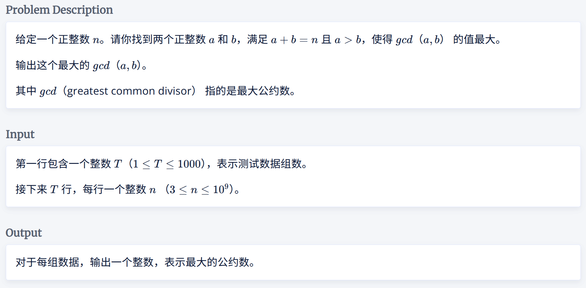
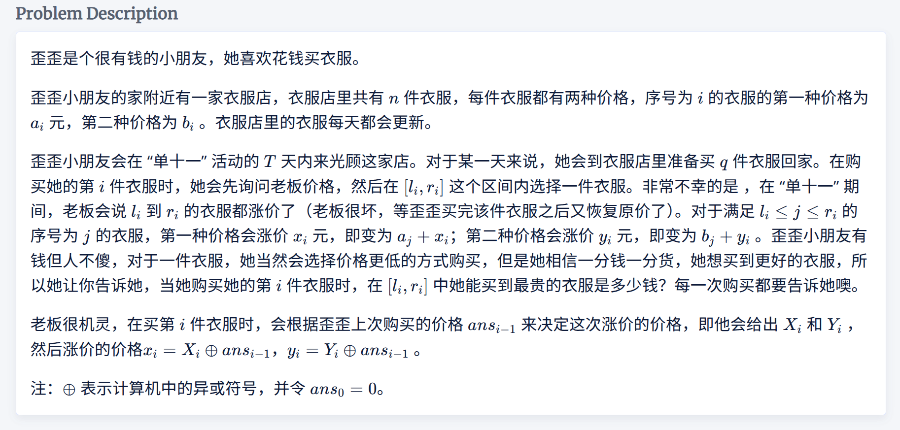

### 1001

签到题，但卡了好久。
太久没写题，对复杂度不够敏感了。
$O(\sqrt{n})$能过的题，没必要用筛法，且素数个数约为$\frac{n}{\ln n}$，对复杂度优化并不大。
考虑$n=xy$，只要$x \ge 3$，则可以将 $x$拆分，得到一种 $gcd(a,b)=y$的方案。因此正解是从$3$开始枚举$n$的因数$x$，用第一个，即最小的，$x$作为答案。再考虑因数$2$的问题，若$n / 2 \ge 3$，则存在$gcd(a,b)=2$的方案，更新答案。

### 1005
在思考过程中，发现“回溯”操作比较重要，可以根据回溯操作进行`dp`，这点是正确的。
但最初时，将状态设为`f[i][2]`：0/1 分别表示是否在 i 处使用回溯操作，这样回溯操作会很好维护，不过会有一个严重的问题是，对于“跳跃”操作没有简单的转移方程，只能通过暴力枚举`i - m - k ~ i - 1`的值进行维护。
如果将暴力枚举设计到状态中，**通过更“复杂”的状态设计简化枚举**，就能降低“跳跃”操作的转移难度，这样所有的转移就都可以按照转移方程的形式完成。
同时在状态更新时，不一定要`f[i] = ...`，也可以使用**填表法**`f[i + k] = f[i] + ...`。如果在这道题中，使用`f[i] = ...`作为“跳跃”的转移方程，则无法方便的做到“走到大于$n$的节点时视为离开”。

### 1008

神了，赛后补的，打了个对拍才过，修改了若干个bug，包括但不限于：
- 关键题意灵机一动读错，导致几发无效提交
- 排序后，仍使用原数组
- 用错循环变量作为block下标

这道题第一眼看来像是类似二维偏序的东西，就是找$a_i \le b_i$且$l_i \le i \le r_i$，但我不确定二维偏序能不能处理区间，而且如果按照$a_i\le b_i$和$a_i > b_i$分类，其实总有一种情况并不好处理。
注意到可以根据$a_i - b_i \le y - x$分类，这种情况只需要找$max a_i$再加上$x$即可。同理对于$a_i - b_i > y - x$，$max b_i + y$为最大。
因此，直觉就是会根据$a_i - b_i$对数组排序方便查找。而我选择了一种相对暴力的方法——**分块**。分块后，只对块内排序，维护前缀$a$最大和后缀$b$最大，通过二分找到分界点后，得到答案，单块复杂度$O(\log n)$。预处理复杂度$O(n)$，枚举分块复杂度$O(\sqrt{n}\log n)$。
这道题还有使用线段树的离线和在线做法，后面再补。